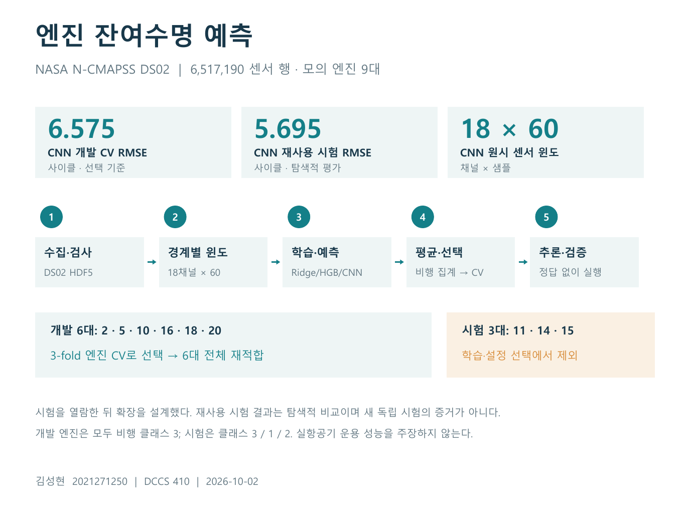
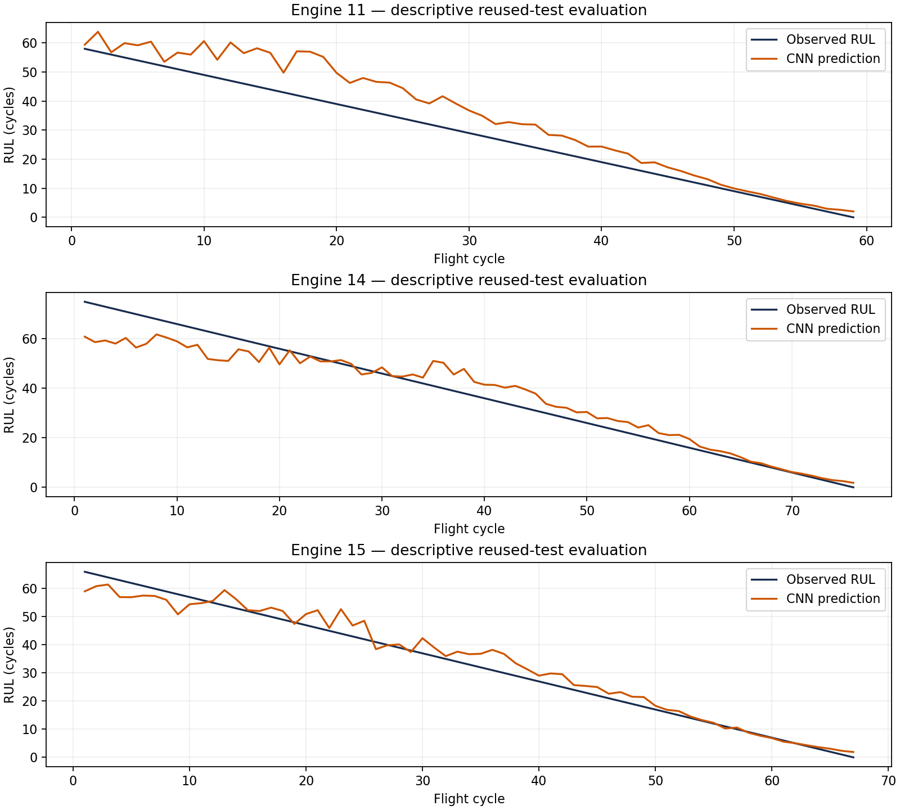
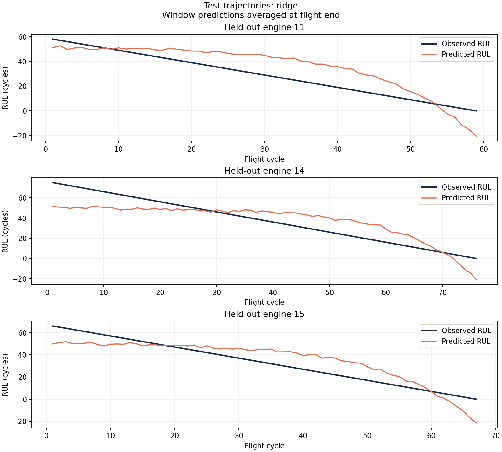
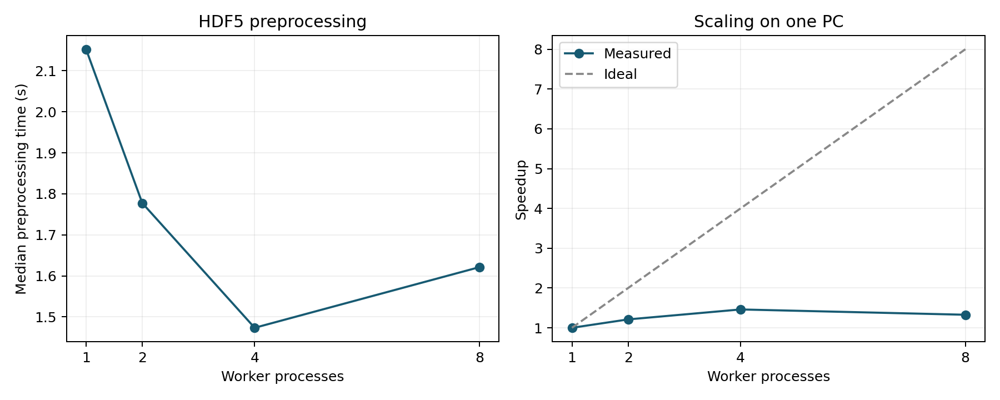

# 항공기 엔진 잔여수명 예측 / Aircraft engine RUL prediction

김성현 · 2021271250 · DCCS410 · 실험일 / Experiment date: 2026-10-02

**구현 완료:** 기준모델, 24개 민감도 후보, GPU 1D CNN, 개발 검증에 따른 최종 모델 선택, 정답 없는 HDF5 예측, 오류 분석, 한영 보고서·발표자료와 제출 묶음을 완성했습니다. 구현을 이후 일정으로 남겨 두지 않았습니다.

**Implementation complete:** baselines, 24 sensitivity candidates, GPU 1D CNN, development-based final model selection, label-free HDF5 prediction, error analysis, bilingual artifacts and source packaging. Implementation is not deferred to the submission dates.

NASA N-CMAPSS DS02의 **6,517,190개 센서 행**을 HDF5 청크 단위로 읽고, 병렬 통계 특징 추출과 잔여수명(RUL) 예측을 실행하는 프로젝트입니다. RUL의 단위는 **남은 비행 사이클 수**입니다. 실제 비행 조건을 반영해 생성한 모의 엔진 데이터이며 실제 항공기 고장 관측 자료는 아닙니다.

This project processes **6,517,190 sensor rows** from NASA N-CMAPSS DS02 through bounded HDF5 reads, parallel feature extraction and RUL regression. RUL is measured in **remaining flight cycles**. The data simulate engine degradation under real flight conditions; they are not observed failures of operational aircraft.

## 한눈에 보는 처리 흐름 / Pipeline at a glance



[English visual overview](output/visuals/project_overview_en.png)

시험 엔진 3대는 모델 선택에 쓰지 않습니다. 기존 실험에서 이미 살펴본 시험 자료의 확장 평가값은 탐색적 결과로 해석합니다. / The three test engines do not drive model selection. Extension scores on previously inspected test data are exploratory.

## 먼저 볼 파일 / Deliverables

| 내용 / Content | 한국어 / Korean | English |
|---|---|---|
| 1쪽 제안서 / One-page proposal | [proposal_ko.pdf](output/proposal_ko.pdf) | [proposal_en.pdf](output/proposal_en.pdf) |
| 실제 실험 보고서 / Experimental report | [report_ko.pdf](output/report_ko.pdf) | [report_en.pdf](output/report_en.pdf) |
| 5분 발표자료, 발표자 노트 포함 / Five-minute slides with speaker notes | [presentation_ko.pptx](output/presentation_ko.pptx) | [presentation_en.pptx](output/presentation_en.pptx) |

- [한영 프로젝트 계획 / Bilingual project plan](docs/project_plan.md)
- [모델 지표 / Model metrics](output/results/metrics.json), [교차검증 결과 / CV results](output/results/cv_results.csv)
- [병렬 처리 측정 / Benchmark summary](output/benchmark/benchmark_summary.csv), [개별 측정 / Individual runs](output/benchmark/benchmark_runs.csv)
- [데이터 구조 검사 / Data inspection](output/data_inspection.json)
- [실행 증거 / Execution record](output/execution_summary.json), [테스트 결과 / Test results](output/test_results.txt)
- [소스·결과 묶음 / Source and results archive](output/submission_source.zip)
- [최종 CNN 모델 설명 / Final CNN model card](output/final/model_card.json), [추론 결과 / Inference results](output/predictions/cycle_predictions.csv)
- [민감도 24개 후보 / 24 sensitivity candidates](output/extended/sensitivity/summary.csv), [CNN 결과 / CNN results](output/extended/cnn/metrics.json)
- [확장 검증 / Extended verification](output/extended_verification.json), [수명 구간별 오차 / Errors by life stage](output/final/error_by_life_stage.csv)

제안서는 프로젝트 목표를, 보고서와 발표자료는 10월 2일 실제 완료한 전체 구현과 실험을 설명합니다. 이후 날짜는 제출 마감일입니다. PDF는 렌더링하여 검사했습니다. DOCX는 편집용 원본이며 페이지 배치는 검증하지 않았습니다. 영어 문서에도 이름을 김성현으로 표기했습니다.

The proposal states the project objectives; reports and slides describe the complete implementation and experiments actually finished on 2 October. Later dates are submission deadlines. PDFs were rendered for visual review. DOCX files are editable sources with unverified pagination. The name remains 김성현 in English documents because no romanization was supplied.

## 실행 / Run

현재 PC에서는 Anaconda Python 환경으로 아래 명령을 실행할 수 있습니다. `complete_project.ps1`은 데이터 수집(없는 경우), 테스트, 전체 실험, 추론, 검증, 문서 재생성과 ZIP 생성을 순서대로 실행합니다. 문서 생성은 이 PC의 Codex 번들 문서 런타임을 사용합니다.

On this PC, use the existing Anaconda Python environment. `complete_project.ps1` runs acquisition if needed, tests, all experiments, inference, verification, document rebuilding and ZIP packaging. Document generation uses this PC's bundled Codex artifact runtime.

```powershell
./tools/complete_project.ps1
# Research pipeline without the Codex document runtime:
./tools/complete_project.ps1 -SkipDocuments
# Rebuild documents and ZIP from existing verified results:
./tools/rebuild_delivery.ps1
# Individual stages:
./run.ps1 -Stage test
./run.ps1 -Stage inspect
./run.ps1 -Stage prepare
./run.ps1 -Stage train
./run.ps1 -Stage benchmark -Repeats 3
./run.ps1 -Stage sensitivity
./run.ps1 -Stage cnn
./run.ps1 -Stage finalize
./run.ps1 -Stage predict
# All experiment stages, including extensions and inference:
./run.ps1 -Stage full -Repeats 3
# Verify saved models, predictions, metrics and benchmark parity:
& "$env:USERPROFILE/anaconda3/python.exe" tools/verify_outputs.py
```

다른 PC에서 / On another PC (Python 3.12 recommended):

```powershell
python -m venv .venv
./.venv/Scripts/python.exe -m pip install -r requirements-tested.txt
./.venv/Scripts/python.exe -m pip install torch==2.5.1 --index-url https://download.pytorch.org/whl/cu121
./.venv/Scripts/python.exe -m pip install -e . --no-deps
./run.ps1 -Stage download
./tools/complete_project.ps1 -SkipDocuments
```

GPU가 없는 PC는 PyTorch 설치 명령 대신 `./.venv/Scripts/python.exe -m pip install -r requirements-neural-cpu.txt`를 사용합니다. 버전별 CPU/CUDA 설치 경로는 [PyTorch 공식 안내](https://pytorch.org/get-started/previous-versions/#v251)를 따릅니다. 이 PC에서는 기존 `torch 2.5.1+cu121`와 RTX 4070 Ti SUPER로 실제 학습했습니다. / For a CPU-only PC, install `requirements-neural-cpu.txt` instead of the CUDA command. The tested GPU environment is PyTorch 2.5.1+cu121 on RTX 4070 Ti SUPER. CPU/GPU timings and floating-point outputs may differ.

`all`은 기존 기준 실험만 실행하는 호환 명령입니다. 전체 구현을 실행하려면 `full` 또는 `complete_project.ps1`을 사용합니다. `full`은 이미 다운로드한 자료를 사용하며 문서 생성은 별도입니다. / `all` retains the original baseline-only workflow. Use `full` for the complete computational pipeline, or `complete_project.ps1` to also acquire missing data and rebuild delivery files.

`run.ps1`은 프로젝트의 `.venv`, 사용자 Anaconda 순서로 Python을 찾습니다. 다른 실행 파일은 `-PythonPath 'C:/path/to/python.exe'`로 지정합니다. 다운로드 크기는 2.45 GB이며 임시 조각과 최종 파일을 조립할 공간이 필요합니다. 다운로드 도구는 조각별 재시도를 지원하며, 검증 후 자체 임시 조각을 정리합니다.

The launcher checks the local `.venv` and then the user's Anaconda installation. Pass `-PythonPath 'C:/path/to/python.exe'` to override. The download is 2.45 GB; allow space for temporary parts plus the assembled file. The downloader supports retries and resumes, verifies integrity, then cleans up its own parts.

설정은 [configs/default.json](configs/default.json)에 있습니다. 윈도·간격·원본을 바꾸면 `prepare`부터 다시 실행해야 합니다. 저장된 특징과 원본·스키마·설정이 맞지 않으면 학습을 중단합니다. Windows에서 병렬 추출 함수를 직접 호출할 때는 `if __name__ == '__main__':` 진입점 보호가 필요합니다.

Settings are in [configs/default.json](configs/default.json). Changing the window, stride or source requires preparation again. Training rejects stale or altered prepared features. Direct calls to multiprocessing extraction on Windows need an `if __name__ == '__main__':` guard; the CLI already provides it.

## 방법 / Method

1. 공식 개발 엔진 6대와 시험 엔진 3대를 유지합니다. / Preserve six official development and three test engines.
2. `W` 운항 조건 4개와 `X_s` 측정 센서 14개만 사용합니다. `T`, `X_v`, 건강 상태와 식별자는 예측 입력에서 제외합니다. / Use four operating and fourteen measured-sensor channels only; exclude latent parameters, virtual sensors, health state and identifiers from predictors.
3. 엔진·비행 경계마다 60개 샘플, 간격 60의 윈도를 구성합니다. 평균·모표준편차·최소·최대·샘플당 OLS 기울기로 90개 특징을 생성합니다. / Reset 60-sample windows with stride 60 at each engine and flight boundary; compute 90 features from mean, population standard deviation, minimum, maximum and OLS slope per sample.
4. 비유한 입력·정답·출력이 있는 윈도와 불완전한 끝부분은 제외합니다. 실제 실행에서 비유한 값 때문에 제외된 윈도는 0개였습니다. / Omit nonfinite windows and incomplete tails; no complete windows were dropped for nonfinite values in this run.
5. 엔진별 3분할 교차검증으로 평균 기준모델, Ridge, 히스토그램 그래디언트 부스팅을 비교합니다. 전처리 학습과 표본 가중치 계산에는 해당 학습 폴드만 사용합니다. / Compare the mean baseline, Ridge and histogram gradient boosting with three engine-disjoint folds. Fit transformations and weights within each training partition only.
6. 각 엔진에 같은 총 학습 가중치, 엔진 내 각 사이클에 같은 총 가중치를 부여하고 평균 가중치가 1이 되게 정규화합니다. / Give engines equal total fitting weight and cycles equal total weight within each engine; normalize weights to mean one.
7. 비행 종료 후 윈도 예측을 평균합니다. 엔진별 사이클 RMSE를 계산한 다음 엔진 간 단순평균을 주요 지표로 사용합니다. / Average windows at flight end; the primary score is the arithmetic mean of per-engine cycle RMSEs, not pooled RMSE.

개발 자료 5,263,447행 → 87,510개 윈도; 시험 자료 1,253,743행 → 20,796개 윈도입니다. 입력 센서 전체를 메모리에 적재하지 않지만, 최종 특징 표는 메모리에 보관합니다. / Development: 5,263,447 rows → 87,510 windows. Test: 1,253,743 rows → 20,796 windows. Raw sensor reads are bounded; the final feature table is materialized in memory.

## 최종 모델과 확장 결과 / Final model and extension results

| 후보 / Candidate | 개발 CV RMSE / Dev CV RMSE | 시험 RMSE / Test RMSE | 시험 MAE / Test MAE |
|---|---:|---:|---:|
| Original Ridge, 60/60, raw | 11.3834 | 11.2762 | 9.8784 |
| Sensitivity winner: Ridge, 30/15, nonnegative | 10.7789 | 10.5913 | 9.0214 |
| **Final: 1D CNN, 60/60, Softplus** | **6.5753** | **5.6955** | **4.5206** |

최종 모델은 **개발 CV 오차가 가장 작은 CNN**입니다. 시험 점수는 선택에 쓰지 않았습니다. 그러나 원래 시험 결과를 확인한 뒤 설계한 확장 실험이므로, 추가 시험 점수는 **기존 시험 세트의 탐색적 재평가**입니다. 새로운 미사용 시험 자료의 일반화 검증으로 해석하지 않습니다. 또한 후보 선택에 사용한 CV 자체도 nested CV가 아닙니다.

The final CNN has the lowest **development CV** error; test scores did not select it. Because extensions were designed after inspecting the original test outcomes, extension test results are **exploratory reuse of the same test set**, not a new untouched validation. Selection CV is not nested CV.

민감도 실험은 `(window,stride)` 30/15, 30/30, 60/30, 60/60, 120/60, 120/120에서 Ridge/HGB와 원시·비음수 정책을 비교했습니다. 36번의 CV 모델 적합에서 정책 2개를 평가해 24개 후보를 순위화했습니다. `max(0,prediction)`은 비행 평균 전에 각 윈도에 적용했습니다. 모든 후보는 같은 엔진 폴드를 사용했습니다.

Sensitivity compares six window/stride pairs, two regressors and two prediction policies, yielding 24 candidates from 36 CV model fits. Nonnegative clipping occurs per window before flight averaging. All candidates share the same engine folds.

CNN은 원시 시계열 18×60 입력과 4,081개 파라미터를 사용합니다. `Conv1d(18→16,k=5) → ReLU → Conv1d(16→32,k=5) → ReLU → global average → Linear → Softplus` 구조입니다. 학습 폴드만으로 가중 채널 정규화를 적합하고, 엔진·사이클 가중 MSE로 학습했습니다. 3개 개발 폴드와 전체 개발 자료에서 각각 고정 12 epoch, batch 512, Adam lr 0.001, target/100을 사용했습니다. 조기 종료나 시험 점수 튜닝은 없습니다. 전체 실행 74.71초, 전체 개발 적합 21.03초를 실제 GPU에서 기록했습니다.

The 4,081-parameter CNN consumes raw 18×60 sequences with two temporal convolutions, global averaging and Softplus. Channel normalization uses only the weighted training partition. Engine/cycle-weighted MSE, 12 fixed epochs, batch 512, Adam 0.001 and target/100 are used for each of three folds and the full-development refit. There is no early stopping or test-score tuning. The measured GPU run took 74.71 s overall, including 21.03 s for the full-development fit.



## 정답 없는 데이터 예측 / Predict unlabeled data

```powershell
./run.ps1 -Stage predict -Dataset 'C:/path/to/new_sensor_data.h5' -Split test
```

입력 HDF5에는 `W_test`, `X_s_test`, `A_test`와 `W_var`, `X_s_var`, `A_var`가 필요합니다. 채널 이름·순서는 기존 DS02와 같아야 하며 `A_var`에는 `unit`, `cycle`이 필요하고 `Fc`는 선택 사항입니다. `-Split dev`이면 배열 이름의 접미사가 `_dev`여야 합니다. **`Y`는 필요하지 않으며 읽지 않습니다.** 엔진 ID는 공식 9개에 한정하지 않습니다.

Input HDF5 needs W, X_s and A arrays for the selected split, with the matching name arrays and original DS02 channel order. A must identify unit/cycle; Fc is optional. **Y is neither required nor read.** New engine IDs are accepted. Output is saved to `output/predictions/`; each run replaces those prediction files. Cycle means are available at recorded flight end.

검증에서는 정답과 건강 상태가 없는 두 비행의 476개 윈도로 추론에 성공했습니다. 전체 시험 20,796개 윈도의 최종 추론 결과도 실험 당시 저장한 예측과 일치합니다. CNN의 시험 사이클 음수 예측은 0개입니다. 사후 진단에서 RUL≤10 구간의 엔진 평균 RMSE는 0.956, RUL>30은 7.186 사이클이었습니다. 구간은 정답으로 나눈 오류 분석용이며 모델 입력이 아닙니다.

Verification predicted 476 windows from two flights without target or health-state arrays. Full inference reproduced the saved 20,796 test-window predictions. CNN has no negative test-cycle predictions. Post-hoc diagnostic macro RMSE is 0.956 for true RUL≤10 versus 7.186 for true RUL>30; these target-defined bins are diagnostic only, not predictors.

## 보존한 최초 기준 실험 / Preserved original baseline

모든 숫자는 비행 사이클 단위의 엔진별 지표를 평균한 값입니다. / All scores below average engine-level cycle errors, in flight cycles.

| 모델 / Model | 개발 CV RMSE / Dev CV RMSE | 시험 RMSE / Test RMSE | 시험 MAE / Test MAE |
|---|---:|---:|---:|
| Mean baseline | 21.9141 | 20.1041 | 17.2349 |
| **Ridge (CV 선택 / selected by CV)** | **11.3834** | **11.2762** | **9.8784** |
| Histogram gradient boosting | 11.7748 | 11.2272 | 9.7553 |

Ridge는 시험 기준모델 대비 RMSE를 약 43.9% 줄였습니다. 부스팅의 시험 RMSE가 조금 낮지만, 시험 결과를 보고 선택을 바꾸지 않았습니다. 세 후보를 개발 자료 전체로 각각 재학습해 시험 성능을 한 번씩 평가했습니다. / Ridge reduced test RMSE by about 43.9% against the baseline. Boosting had a slightly lower test RMSE, but model selection remains fixed by development CV. Each candidate was refitted on all development engines and evaluated once on test engines.

Ridge는 시험 202개 사이클 중 15개에서 음수 RUL을 출력했습니다(최소 -21.42). 후처리 없이 원래 예측값으로 평가했으며, 운영용 잔여수명 추정치로 사용하기에는 물리적 제약이 부족합니다. / Ridge produced negative RUL for 15 of 202 test cycles (minimum -21.42). Scores retain raw predictions without clipping; the model lacks physical constraints needed for operational use.



## 병렬 실험 해석 / Benchmark interpretation

전체 개발 자료의 동일한 특징 추출을 작업자 1·2·4·8개로 비교했습니다. 기본 읽기 상한은 120,000행이며 실제 읽기는 비행 구간 끝에서 잘립니다. 작업자 4개에서는 1,024행과 8,192행 상한도 비교합니다. 상한이 실제 구간 길이보다 크면 더 큰 청크를 설정해도 읽기가 늘어나지 않습니다.

Compare identical extraction on the full development split using 1, 2, 4 and 8 workers. The default read cap is 120,000 rows, bounded further by each flight segment. Four-worker runs also test 1,024 and 8,192 rows. Caps larger than a segment do not cause larger reads.

한 차례 전체 워밍업 후 설정별 3회씩 무작위 순서로 실행합니다. 각 실행은 새 Python 프로세스를 사용하고 수치 라이브러리 스레드는 1개로 제한합니다. 시간은 HDF5 검사·읽기, 프로세스 생성(작업자 import 포함), 특징 계산·조립을 포함하며 부모 프로세스의 최초 import, 결과 해시와 저장은 제외합니다. 실행마다 모든 출력 행의 순서·스키마·값이 동일한지 확인합니다.

After one full warmup, run three repeats per setting in seeded random order, each in a fresh process with one numerical-library thread. Timing includes HDF5 inspection/reads, worker startup (including worker imports), feature calculation and assembly; initial imports in the parent process, hashing and saving are excluded. Ordered output values and schema must match across runs.

메모리는 100ms마다 프로세스 트리의 RSS 합을 관측한 최댓값입니다. 공유 페이지가 중복 집계될 수 있어 실제 물리 메모리 사용량과 같지 않습니다. OS 캐시를 비우지 않았으며 단일 PC의 결과입니다. / Memory is peak sampled process-tree RSS at 100 ms intervals; shared pages may be counted more than once. The OS cache is not flushed. Results describe one PC, not cold-disk performance or multi-node scaling.

| 작업자 / Workers | 읽기 상한 / Read cap (rows) | 중앙값 / Median (s) | 속도비 / Speedup | 최대 RSS 합 / Peak summed RSS (MiB) |
|---:|---:|---:|---:|---:|
| 1 | 120,000 | 2.153 | 1.000x | 201.0 |
| 2 | 120,000 | 1.778 | 1.211x | 389.9 |
| 4 | 1,024 | 2.343 | 0.919x | 558.1 |
| 4 | 8,192 | 1.637 | 1.315x | 564.3 |
| 4 | 120,000 | 1.473 | 1.461x | 577.5 |
| 8 | 120,000 | 1.621 | 1.328x | 933.5 |

4개 작업자가 가장 빨랐습니다. 8개에서는 메모리 지표가 커지고 속도가 낮아졌습니다. I/O·메모리 대역폭·프로세스 생성 비용은 가능한 설명이며 각각을 분리 측정한 결과는 아닙니다. / Four workers were fastest. Eight increased the memory measure and slowed extraction. I/O, memory bandwidth and process startup are plausible explanations; their individual costs were not profiled.



## 한계 / Limitations

- 독립 시험 엔진은 3대입니다. 수만 개 윈도를 독립적인 엔진 표본 수로 해석하면 안 됩니다. / Only three independent test engines; windows do not increase the independent engine sample size.
- 개발 엔진은 모두 비행 클래스 3이고, 시험 엔진 14·15는 각각 클래스 1·2입니다. 운항 조건 변화의 영향을 추가로 검증해야 하며 이 실험만으로 인과관계를 입증하지 않습니다. / All development engines are class 3; test engines 14 and 15 are classes 1 and 2. This shift merits further validation; the experiment does not establish a causal effect.
- 사이클 평균 예측은 기록된 비행 종료 시점에 가능합니다. 실시간 조기 예측 성능과 다릅니다. / Cycle-averaged estimates become available at the end of the recorded flight, not earlier online.
- 단일 PC에서 CPU 병렬 처리와 GPU CNN을 구현했습니다. Spark·다중 노드·실제 항공기 배치는 프로젝트 범위에 포함하지 않습니다. / Implemented single-PC CPU multiprocessing and GPU CNN training; Spark, multi-node systems and operational aircraft deployment are outside the project scope.
- 비음수 출력만으로 물리적 정확성이나 정비 의사결정 적합성이 보장되지 않습니다. / Nonnegative outputs do not establish physical accuracy or suitability for maintenance decisions.

## 출처·무결성 / Provenance and integrity

- Original: [NASA PCoE repository, entry 17](https://www.nasa.gov/intelligent-systems-division/discovery-and-systems-health/pcoe/pcoe-data-set-repository/), *Turbofan Engine Degradation Simulation-2*.
- Paper: Arias Chao et al. (2021), [Aircraft Engine Run-to-Failure Dataset under Real Flight Conditions for Prognostics and Diagnostics](https://doi.org/10.3390/data6010005).
- Downloaded artifact: Hao Li's [Figshare DS02 mirror, version 1](https://doi.org/10.6084/m9.figshare.20436504.v1), advertised under CC BY 4.0.
- File: `N-CMAPSS_DS02-006.h5`, 2,450,472,504 bytes.
- Verified against mirror MD5: `61056251b36290e11371e017eed70eac`.
- Computed SHA-256: `47971a68b239ecb756833218a95d68ded6eb7e63ee84e86671c8b188de1ca765`.

미러는 NASA의 원배포와 구별하여 기록했습니다. NASA 원본 묶음과 바이트 단위로 같다고 검증한 것은 아닙니다. 원시 데이터는 Git 및 제출 압축 파일에 포함하지 않으며 다운로드 스크립트와 출처 기록으로 재수집합니다. / The third-party mirror is recorded separately; byte-for-byte equivalence with NASA's original bundle has not been established. Raw data are excluded from Git and the submission archive; acquisition is reproducible through the downloader and manifests.

## 코드 구조 / Source map

| 경로 / Path | 역할 / Purpose |
|---|---|
| `src/ncmapss_rul/data.py` | HDF5 구조 검사, 경계 탐색 / Layout validation and segment discovery |
| `src/ncmapss_rul/features.py` | 제한된 읽기, 직렬·병렬 특징 추출 / Bounded reads and serial/parallel features |
| `src/ncmapss_rul/modeling.py` | 엔진 분할, 학습, 지표, 그림 / Engine splits, models, metrics, plots |
| `src/ncmapss_rul/experiments.py` | 24개 민감도 후보와 개발 전용 선택 / Sensitivity study and development-only selection |
| `src/ncmapss_rul/neural.py` | 검증된 시계열 캐시, GPU/CPU CNN 학습과 추론 / Verified sequence cache and CNN training/inference |
| `src/ncmapss_rul/inference.py` | 최종 모델 선택과 정답 없는 HDF5 예측 / Final model selection and label-free HDF5 prediction |
| `src/ncmapss_rul/__main__.py` | 실험 CLI, 특징 무결성, 벤치마크 / Experiment CLI, integrity and benchmarks |
| `tests/` | 경계·누수·지표·병렬 일치·무결성 검증 / Boundaries, leakage, metrics, parity and integrity |
| `tools/download_data.py` | 재시도·재개·체크섬 검증 다운로드 / Resumable verified acquisition |
| `tools/build_proposals.py`, `tools/build_reports.py`, `tools/build_slides.mjs` | 문서·발표 생성 / Document and slide builders |
| `tools/complete_project.ps1`, `tools/rebuild_delivery.ps1` | 전체 실행 및 문서·ZIP 재생성 / Complete run and delivery rebuild |
| `tools/verify_extended.py`, `tools/analyze_errors.py` | 확장 결과 검증과 오류 분석 / Extension verification and error analysis |

문서 생성 스크립트는 Codex 번들 문서 런타임과 Windows 글꼴을 사용합니다. 실험 코드는 `requirements-tested.txt`와 PyTorch 설치로 재실행할 수 있습니다. `configs/extended.json`은 고정한 확장 실험 명세이고, 실제 실행 명세와 선택 시각은 각 결과 폴더의 `protocol.json`에 기록합니다. / Artifact builders use Codex's bundled document runtime and Windows fonts. The research pipeline needs the tested requirements plus PyTorch. `configs/extended.json` records the fixed extension specification; executed protocols and selection timestamps are retained with results.
